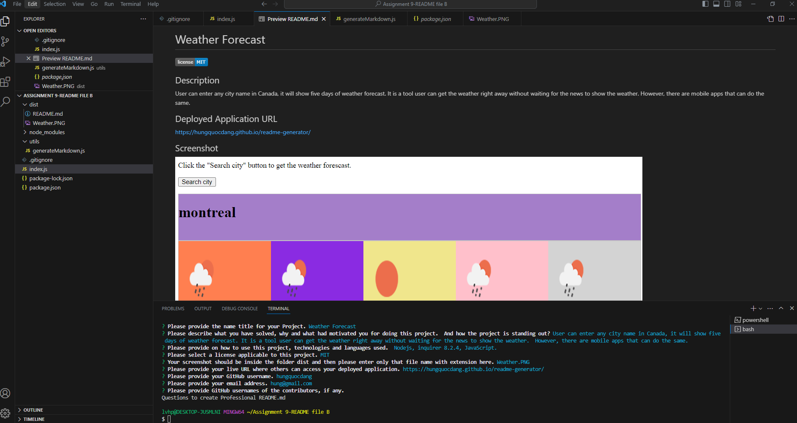

# Description

This project is to create a professional README.md for anyone wanting to write a README.md for their project; the user will fill out the questionnaires that will yield as information to be displayed on the README.md file which is also be written in the VS page as Open Preview.

# Link

live url: https://hungquocdang.github.io/readme-generator/
Github url: https://github.com/HungQuocDang/readme-generator

Screecastify link: https://drive.google.com/file/d/1KOFbzEfchBflnXNAf_yZC3k9bncuZUNz/view

# Screenshot

# readme-generator
